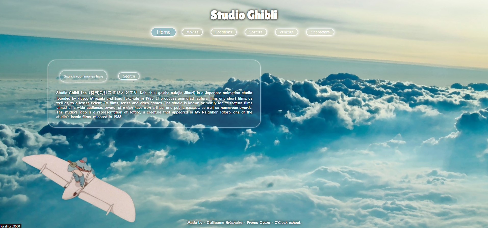
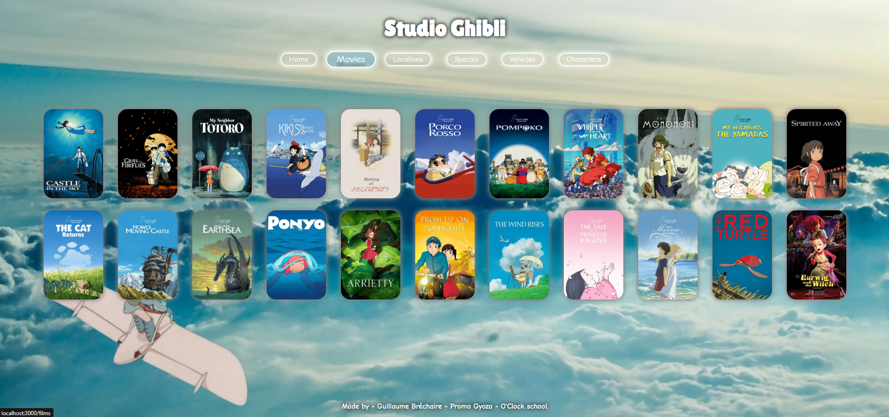
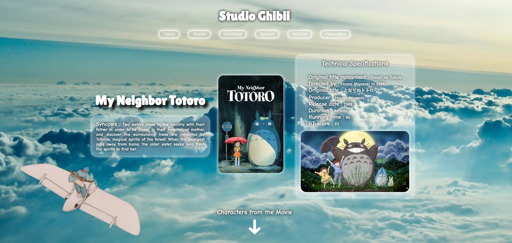
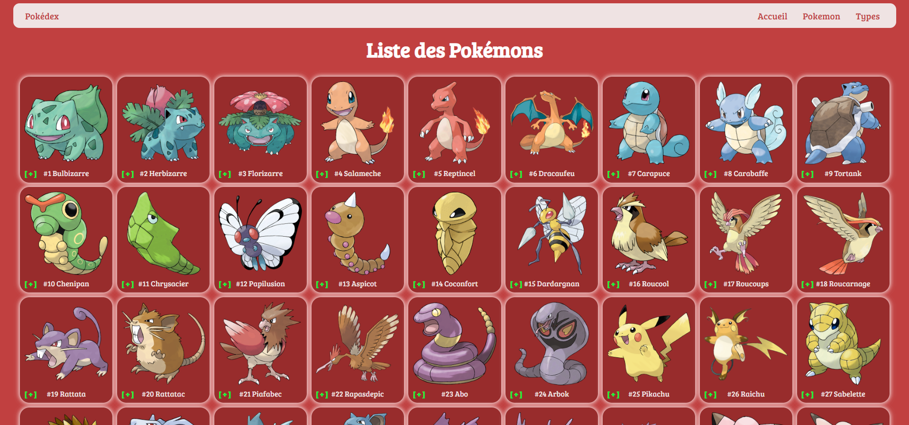
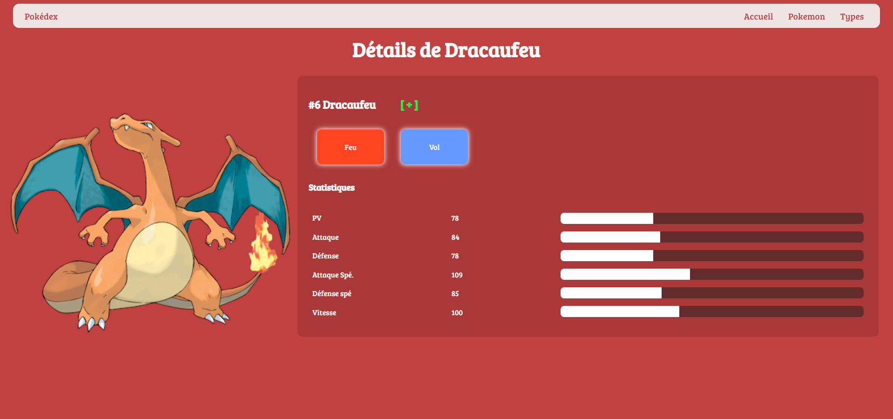
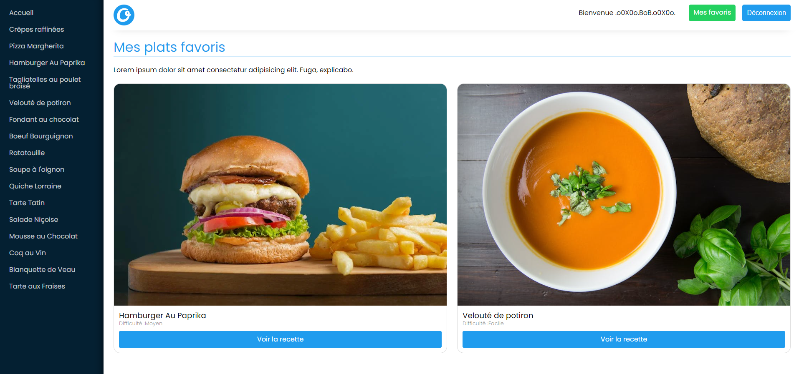
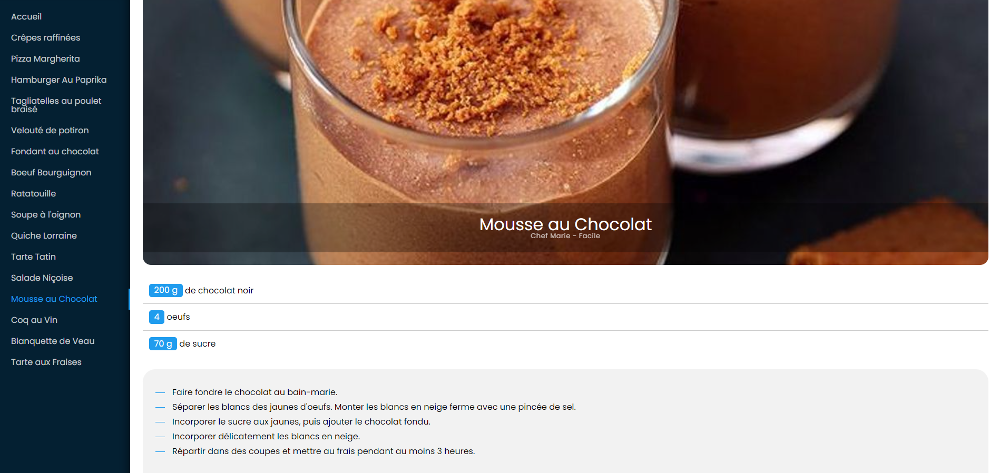
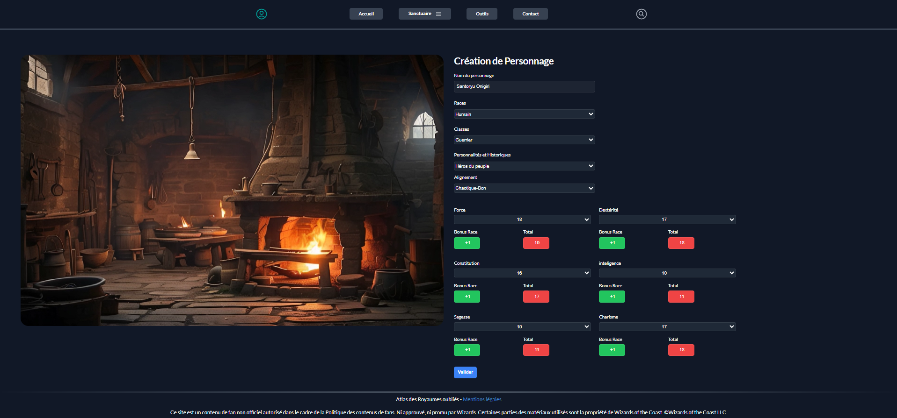
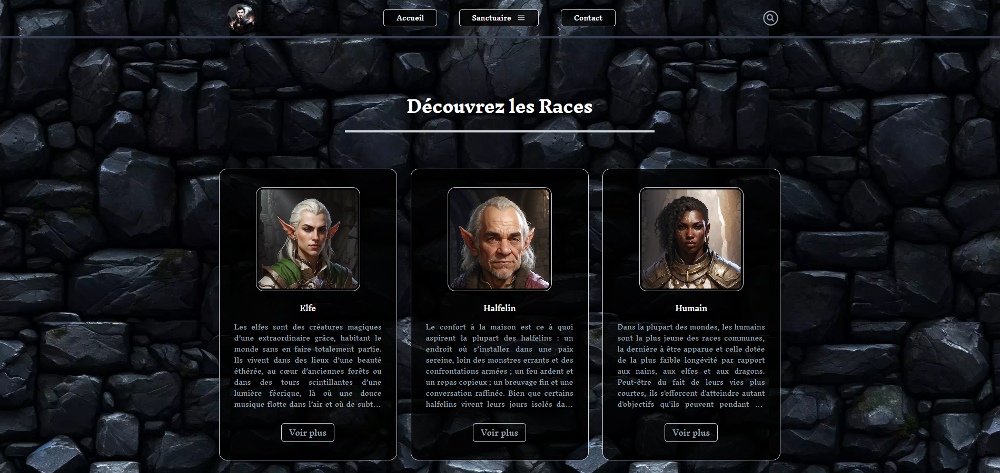
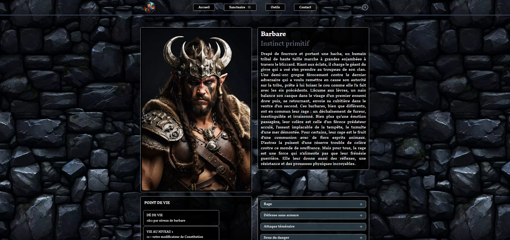

# Portfolio de Guillaume Bréchaire

Bienvenue sur mon portfolio interactif de Développeur Fullstack JavaScript. Ce site a été conçu pour présenter mes projets et mon parcours professionnel de manière fluide et intuitive, avec un design minimaliste et élégant. Il est entièrement responsive et accessible sur tous les appareils, offrant une expérience utilisateur optimale.

## Navigation

Le site est structuré en plusieurs sections principales :

- **Présentation** : Une introduction à mon parcours et à mes compétences.
- **Projets** : Une vitrine de mes projets réalisés lors de ma formation et en freelance.
- **Expériences** : Un aperçu de mes expériences professionnelles et de mes réalisations.
- **Contact** : Un formulaire pour entrer en contact avec moi.

## Présentation

### À propos de moi

Je suis Guillaume Bréchaire, un développeur Fullstack JavaScript récemment diplômé d'un titre professionnel de développeur web et web mobile (équivalent à un Bac +2). Spécialisé en React.js, je suis passionné par l'apprentissage continu et la résolution de défis techniques.

- **Formation** : Titre professionnel de développeur web et web mobile.
- **Compétences** : JavaScript, React.js, Redux, Typescript, Node.js, Express, PostgreSQL, Git, GitHub.
- **Centres d'intérêt** : Sciences, astronomie, mangas.

### Objectifs

Mon objectif est de dépasser les attentes des utilisateurs en proposant des solutions innovantes et intuitives. Je suis actuellement à la recherche d'opportunités professionnelles en tant que développeur Fullstack JavaScript.

## Projets

### Projets de formation

#### Ghibliothèque

Un site exclusivement back-end utilisant l'API Studio Ghibli pour offrir un accès complet à un catalogue de films Ghibli, avec des fonctionnalités de recherche avancée et des pages dynamiques générées avec EJS.

#### Pokedex

Un site interactif permettant aux utilisateurs de créer un Pokedex personnalisé en ajoutant leurs propres Pokémon, avec des pages dynamiques générées avec EJS et une base de données PostgreSQL.

#### O'Recipes

Une plateforme de recettes culinaires conçue avec React, Vite, et Redux pour le frontend, et Node.js et Express pour le backend, offrant une authentification sécurisée et une fonctionnalité de favoris.

### Projet d'Apothéose

#### L'Atlas des Royaumes Oubliés

Une application web pour les passionnés de Donjons et Dragons, permettant de créer, personnaliser et gérer des personnages, et de concevoir des campagnes. L'application propose également une encyclopédie complète.

## Contact

Pour toute question ou proposition de projet, n'hésitez pas à me contacter via le formulaire de contact sur le site, ou à travers mes profils LinkedIn et GitHub.

- **LinkedIn** : [Guillaume Bréchaire](https://www.linkedin.com/in/guillaume-brechaire)
- **GitHub** : [Guillaume-93](https://github.com/Guillaume-93)

## Licence

Le code de ce projet est sous licence MIT. Voir le fichier [LICENSE](LICENSE) pour plus de détails.

Les documents (images, logos, etc.) de ce projet sont protégés par le droit d'auteur. Voir le fichier [LICENSE-DOCUMENTS](LICENSE-DOCUMENTS) pour plus de détails.

Pour toute demande d'autorisation concernant les documents, veuillez contacter Guillaume Bréchaire à [guillaume.dev.js@gmail.com](mailto:guillaume.dev.js@gmail.com).
